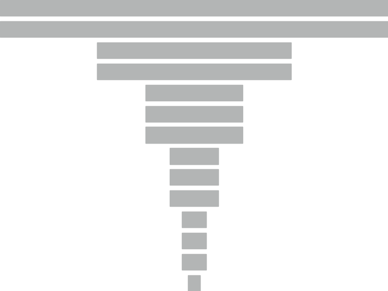
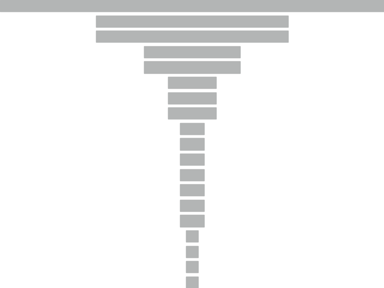

# Shape Adaptor
This repository contains the source code to support the paper: [Shape Adaptor: A Learnable Resizing Module](https://arxiv.org/abs/2008.00892), by [Shikun Liu](shikun.io) and [Adobe Research Team](https://research.adobe.com/). 

> Shape Adaptor is a **learnable** pooling module designed for convolutional neural networks (CNNs), automatically learning suitable resizing factors for a training dataset.


## Datasets
This project evaluates on image classification tasks. For small-resolution datasets: CIFAR-10/100, and SVHN, you may directly download them based on the official PyTorch data loader. For fine-grained large-resolution datasets: Aircraft, CUB-200 and Stanford Cars, you may download the organised datasets with the PyTorch format [in this link](https://www.dropbox.com/sh/m11soye2pj9gvv3/AAAv-aBKOQB65o_1BabkOghaa?dl=0). In AutoTL experiments, we evaluated with the datasets available [in this repo](https://github.com/arunmallya/piggyback). 

*Please note that part of the datasets provided in the above links, evaluated in Table 1 (in the original paper) and AutoTL, come from the same source, but they are different in pre-processing: All experiments done in Table 1 were based on raw, un-cropped images; while in AutoTL, the training images in some datasets were cropped (CUB-200, and Stanford Cars specifically, to be consistent with prior works).*

## Experiments
You may reproduce most of the experiments presented in the paper with the following code.

File Names | Description
---------- | -----------
`utils.py` | a list of dataset mean and variance used for data loader
`model_list.py` |  shape adaptor formulations and network architecture design for VGG, ResNet and MobileNetv2 
 `model_training.py` | training and evaluation for shape adaptor networks, vanilla human-defined networks, and AutoSC.
 `model_training_autotl.py`  | training and evaluation for AutoTL

To run any experiment, you need to first create two directories for dataset and logging by `mkdir {dataset,logging}`, and then move the downloaded datasets into the created `dataset` folder. 

To run experiments on AutoTL: you need to create a sub-folder `autotl` under the `dataset` directory, and then move the downloaded 5 transfer learning datasets into that folder. Please remember to rename the folder of each dataset in `autotl`, corresponding to the naming defined in the dataset flag from the  `model_training_autotl.py` file. Eventually, you would expect to have the following directory structure.

```
shape-adaptor
├── logging
└── dataset
    ├── aircraft    
    ├── cub_200  
    ├── stanford-cars
    ├── autotl
    │   ├── cub_200
    │   ├── sketches
    │   ├── stanford-cars
    │   ├── vgg-flowers
    │   └── wiki-art
    ├── utils.py
    ├── model_list.py
    ├── model_training.py
    └── model_training_autotl.py
```


For training with shape adaptor networks, original human-designed networks, or AutoSC (automated shape compression) on non-ImageNet datasets, please run: 

- `python model_training.py --FLAG_NAME 'FLAG_VALUE'` (for small-resolution datasets)
- `python model_training.py --FLAG_NAME 'FLAG_VALUE' --lr 0.01 --batch_size 8 --input_dim 224` (for fine-grained large-resolution datasets)

For training with AutoTL (automated transfer learning) with ResNet-50, please run: 

- `python model_training_autotl.py --FLAG_NAME 'FLAG_VALUE'`

For training with ImageNet in a multi-gpu distributed setting, please run:
- `python model_training_imagenet.py --FLAG_NAME 'FLAG_VALUE'` (Check out [this official ImageNet training file](https://github.com/pytorch/examples/tree/master/imagenet) for the usage of each flag)


All flags are explained in top of each training file, and the default option for each flag represents the one we experimented in the paper. 

### Memory Bounded Shape Adaptor
For training standard shape adaptor networks (not AutoSC), you may use the flag `limit_dim` to constrain the dimensionality of the last layer, to grow no more than this user-defined `limit_dim` value. We set `limit_dim` no larger than the running GPU memory, and thus this value is not fixed, but depending on each specific hardware model and memory size. For ImageNet training with 8 NVIDIA Tesla P100 set-up, we set `limit_dim=15`. For other large-resolution datasets, we set `limit_dim=30` in a single GPU set-up. We did no apply `limit_dim` in smaller resolution datasets, since they all grow no more than the GPU memory. 

An easy trick to find out this value is to train the network first without any memory limit, and to wait it eventually reaches the `GPU Out of Memory` issue (if it never reaches this issue, then we are good here). Then, in `current shape` of the printing log, it prints out the dimensionality of each layer for the entire network. Finally, the last number of `current shape` before having OOM issue is then the maximal dimension we can have in this running GPU, and we may re-train the network by setting `limit_dim` to be that number.

### A Toy Example
If you think the above implementation is a little bit difficult to understand, or simply want to play with some easy experiments, we have also provided a toy example to help you get start with. This toy example `vgg16_cifar_toy.py` includes a VGG-16 model evaluated on CIFAR-100 dataset, and it provides with two flags only: `gpu`: the training GPU ID; and `mode`: shape-adaptor, and human, representing human-defined network and shape adaptor network, respectively. We hard-coded the network structure, shape adaptor hyper-parameters, and removed all other redundant code to maximise readability.  Different from the full version in  `model_training.py` where we insert shape adaptors uniformly across all network layers, shape adaptors in this toy example are attached based on the human-defined resizing layer locations (for readability purpose, no prominent performance change).  


## Shape Visualisation
To visualise network shapes, you may modify the file `visualise_shape.py` to generate shapes look like the ones we presented in the paper. The following figures present the visualisations of network shapes for the original human-designed VGG-16, ResNet-50 and Mobilenetv2 respectively, based on our provided code.

VGG-16 | ResNet-50 | MobiletNetv2
------- | --------| ------------
 |   | 

## Other Comments
1. The provided code is highly optimised for readability, with heavy documentations to assist readers to better understand this project. When training with default options and hyper-parameters, you should expect to achieve similar performances (at most +-2\% difference), compared to the numbers presented in the paper. If you met some weird errors, or simply require some additional help on understanding any part of the code, please contact me directly, or just post an issue in this repo (preferred, so everybody could see it).

2.  We did not perform any heavy hyper-parameter search based on each network and each dataset, i.e., you could possibly achieve a even better result by further tuning the hyper-parameters. Please also check out the appendix in the paper for the negative results: this might save you some time, if you are planning to improve shape adaptors for your own research.

3. Training shape adaptor networks are slow (compared to the training time on human-designed networks only, still much faster than most NAS methods). This is mainly due to the optimal shapes learned from shape adaptors require much more memory than the one from human-designed network shapes. AutoSC and memory-constrained shape adaptors are the only initial solutions to alleviate this problem, but we believe a better shape could be found by breaking the linear relationship between feature weightings and reshaping factors (an important future direction).

4. We have also provided a general formation for shape adaptors in a multi-branch design in Appendix A. Though we did not implement this general version with any experiment, we believe this could be a promising direction towards building an AutoML system to learn neural shape and structure in a unified manner (another important future direction). 


## License
Copyright (C) by Adobe Inc.

Licensed under the CC BY-NC-SA 4.0 (Attribution-NonCommercial-ShareAlike 4.0 International)

The code is released for academic research and non-commercial use only.


## Citation
If you found this code/work to be useful in your own research, please considering citing the following:

```
@inproceedings{shape_adaptor,
  title={Shape Adaptor: A Learnable Resizing Module},
  author={Liu, Shikun and Lin, Zhe and Wang, Yilin and Zhang, Jianming and Perazzi, Federico and Johns, Edward},
  booktitle={Proceedings of the European Conference on Computer Vision (ECCV)},
  year={2020}
}
```


## Contact
If you have any questions, please contact `sk.lorenmt@gmail.com`.

